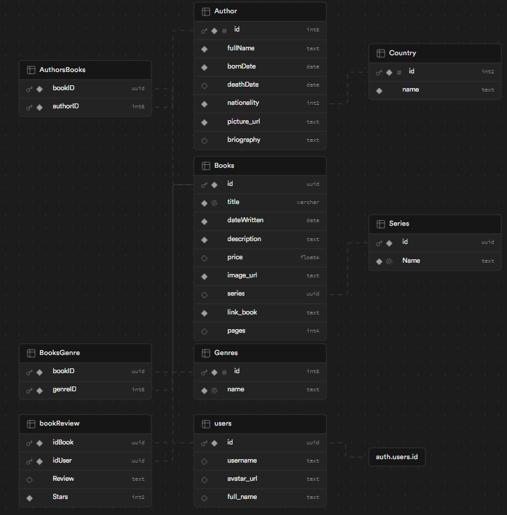

# Step's: Platform for Downloading Books, Publishing Reviews, and Rating

Step's is an innovative platform designed for book lovers, where they can discover, download, review, and rate a wide range of books of any genre. With an intuitive interface and exciting features, Step's stands out as a vibrant community for literature enthusiasts.

---

## Key Features

- **Book Download**: Access an extensive library of digital books to download and read anytime, anywhere.

- **Review Publication**: Share your opinions on the books you've read, helping other users make informed decisions about what to read next.

- **Book Rating**: Rate books based on your reading experience, allowing other users to know the quality and popularity of each title.

- **Detailed Visualizations**: Explore detailed information about books, series, and authors, including popularity statistics, featured reviews, and more.

- **Connection with Supabase**: Step's harnesses the power of Supabase to efficiently and securely manage user data, books, and reviews.

---

## Technologies Used

- **Next.js**: A React.js framework that enables the creation of efficient and scalable single-page web applications.

- **TypeScript**: A programming language that adds optional static types to JavaScript, making error detection and code maintenance easier.

- **Tailwind CSS**: A CSS design framework that simplifies the creation of customized and stylized user interfaces quickly and easily.

- **pnpm**: A package manager for JavaScript that optimizes the installation and management of dependencies, ensuring a more efficient development experience.

---

## Installation

Run the following commands

```
pnpm install
pnpm run dev
```

The server will run on port `localhost:3000`

## Considerations

A `.env.local` file is required to add the Supabase keys, and a **Supabase** database with the following tables is needed



Additionally, the correct connections must be made with the `auth.user` and `users` tables.

## Contribute

Step's is a growing community, and we are always looking for ways to improve! If you have ideas for new features, find bugs, or simply want to contribute to the code, feel free to join our repository on GitHub!

---

Join the Step's community today and immerse yourself in the exciting world of digital reading!
